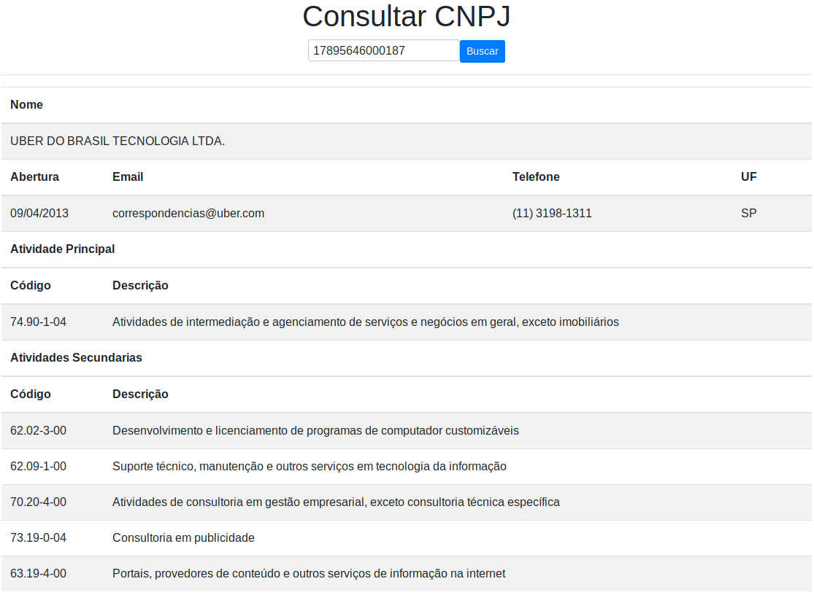

Este repositório faz parte da prova de seleção para estagiário na EBI Informática.

## Uso

Clone esse repositório: `dale`
No diretório do projeto execute: `npm install` e em seguida `npm start`
Aguarda o processo, uma aba será aberta em seu navegador com a seguinte tela:


Basta inserir um CNPJ no campo de busca e clicar em buscar.
Exemplo de resposta:


## Observações

Ao realizar requisições para a API da receita foi necessário usar alguns plugins para habilitar cors, e ao fazer o deploy dessa aplicação identifiquei que usuários sem o plugin no nevegador não conseguiam fazer a busca. Então na requisição para a api eu utilizei o [cors anywhere](https://cors-anywhere.herokuapp.com/) para evitar que seja necessário a instalação de plugins. Por esse motivo a aplicação pode ser um pouco lenta para fazer a requisição.
Esta observação se refere a este trecho de código:
```javascript
const cors = 'https://cors-anywhere.herokuapp.com/'
const endpoint = 'https://www.receitaws.com.br/v1/cnpj/'
fetch(cors + endpoint + doc)
```


## Available Scripts

In the project directory, you can run:

### `npm start`

Runs the app in the development mode.<br />
Open [http://localhost:3000](http://localhost:3000) to view it in the browser.

The page will reload if you make edits.<br />
You will also see any lint errors in the console.

### `npm test`

Launches the test runner in the interactive watch mode.<br />
See the section about [running tests](https://facebook.github.io/create-react-app/docs/running-tests) for more information.

### `npm run build`

Builds the app for production to the `build` folder.<br />
It correctly bundles React in production mode and optimizes the build for the best performance.

The build is minified and the filenames include the hashes.<br />
Your app is ready to be deployed!

See the section about [deployment](https://facebook.github.io/create-react-app/docs/deployment) for more information.

### `npm run eject`

**Note: this is a one-way operation. Once you `eject`, you can’t go back!**

If you aren’t satisfied with the build tool and configuration choices, you can `eject` at any time. This command will remove the single build dependency from your project.

Instead, it will copy all the configuration files and the transitive dependencies (Webpack, Babel, ESLint, etc) right into your project so you have full control over them. All of the commands except `eject` will still work, but they will point to the copied scripts so you can tweak them. At this point you’re on your own.

You don’t have to ever use `eject`. The curated feature set is suitable for small and middle deployments, and you shouldn’t feel obligated to use this feature. However we understand that this tool wouldn’t be useful if you couldn’t customize it when you are ready for it.

